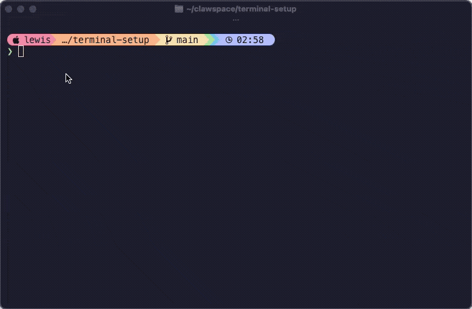

# 🖥️ fe-setup

一键配置**前端开发环境**：以 **macOS** 为主力，兼顾 **Debian/Ubuntu** 和 **Windows (WSL)**。新机器跑一个脚本，几分钟搞定完整终端 + Node.js + 前端 CLI + GUI 应用 + Git/SSH 身份 + Cursor agent 完成通知 hook。

基于 [`lewislulu/terminal-setup`](https://github.com/lewislulu/terminal-setup) 个人化定制，新增可选层：`--frontend` / `--ai` / `--accounts`。

**🇬🇧 [English Version](README.md)**

<p align="center">
  
  &nbsp;&nbsp;
  
  &nbsp;&nbsp;
  
  &nbsp;&nbsp;
  
</p>

<p align="center">
  
</p>

## 支持平台

| 平台 | 状态 | 包管理器 |
|------|------|---------|
| 🍎 **macOS** | ✅ 主力平台 — 长期使用验证 | Homebrew |
| 🐧 **Debian / Ubuntu** | 🧪 实验性 — 可用但未经长期测试 | apt + 内置二进制 |
| 🪟 **Windows (WSL)** | 🧪 实验性 — 可用但未经长期测试 | apt（WSL 内部） |

> **注意：** 本脚本主要在 macOS 上开发和测试。Linux（Debian/Ubuntu）和 WSL 支持已添加且可用，但尚未经过长期使用测试。欢迎提 Issue 和 PR！
| 🪟 **Windows (原生)** | ⛔ 不支持 | 请先安装 WSL |

## 快速开始

### macOS

```bash
git clone https://github.com/woshiwanglizhi/fe-setup.git
cd fe-setup && ./setup.sh
```

### Debian / Ubuntu

```bash
git clone https://github.com/woshiwanglizhi/fe-setup.git
cd fe-setup && ./setup.sh
```

### Windows (WSL)

先安装 WSL（如果还没有）：
```powershell
# 在 PowerShell（管理员）中运行
wsl --install
```

然后在 WSL 中：
```bash
git clone https://github.com/woshiwanglizhi/fe-setup.git
cd fe-setup && ./setup.sh
```

### 选项

```bash
./setup.sh --fish       # Fish shell
./setup.sh --zsh        # Zsh + 类 Fish 插件
./setup.sh --dry-run    # 预览会做什么（不做任何改动）
```

一行命令（自动 clone）：

```bash
bash <(curl -fsSL https://raw.githubusercontent.com/woshiwanglizhi/fe-setup/main/setup.sh)
```

## 选择你的 Shell

| | 🐟 Fish | 🐚 Zsh |
|---|---------|---------|
| **POSIX 兼容** | ❌ 自有语法 | ✅ 兼容 |
| **自动补全建议** | ✅ 内置 | ✅ 通过插件 |
| **语法高亮** | ✅ 内置 | ✅ 通过插件 |
| **Node 管理** | fnm（共享） | fnm（共享） |
| **配置文件** | `~/.config/fish/config.fish` | `~/.zshrc` |
| **适合** | 开箱即用，省心 | 写脚本，POSIX 兼容 |

## 工具栈

| 组件 | 说明 |
|------|------|
| **[Ghostty](https://ghostty.org)** | GPU 加速终端模拟器 |
| **Fish** 或 **Zsh** | Shell（你选） |
| **[Starship](https://starship.rs)** | 跨 Shell 提示符（Catppuccin Mocha 主题） |
| **MesloLGS NF** | Nerd Font，提供图标和 Powerline 字形 |
| **[bat](https://github.com/sharkdp/bat)** | 带语法高亮和行号的 `cat` |
| **[eza](https://github.com/eza-community/eza)** | 带图标、git 状态、树形视图的 `ls` |
| **[fd](https://github.com/sharkdp/fd)** | 更快更直观的 `find` |
| **[ripgrep](https://github.com/BurntSushi/ripgrep)** | 比 `grep` 快几个数量级 |
| **[fzf](https://github.com/junegunn/fzf)** | 模糊查找器（Ctrl+R / Ctrl+T / Alt+C） |
| **[btop](https://github.com/aristocratos/btop)** | 漂亮的系统监控 |
| **[zoxide](https://github.com/ajeetdsouza/zoxide)** | 智能 `cd`，学习你的习惯 |
| **[jq](https://github.com/jqlang/jq)** | JSON 处理器 |
| **[tldr](https://github.com/tldr-pages/tldr)** | 简化版 man 手册，附带示例 |
| **[delta](https://github.com/dandavison/delta)** | 带语法高亮的 git diff |
| **[lazygit](https://github.com/jesseduffield/lazygit)** | Git 终端 UI |
| **[fnm](https://github.com/Schniz/fnm)** | 快速 Node 版本管理器（Rust 编写） |
| **[Zellij](https://zellij.dev)** | 现代终端复用器（可选） |

## 脚本做了什么

1. 安装**包管理器**（macOS 用 Homebrew，Linux 用 apt）
2. 安装 **Ghostty** 终端（macOS；Linux 需手动安装）
3. 下载 **MesloLGS NF** Nerd 字体
4. 安装你选择的 **Shell** + 插件
5. 安装所有 **CLI 工具**（macOS 用 Homebrew，Linux 用 apt + GitHub releases）
6. 安装 **Starship** 提示符 + Catppuccin Mocha 配置
7. 安装 **fnm** + **Node.js** LTS（可选）
8. 安装 **Zellij** 终端复用器（可选）
9. 部署所有配置文件（已有配置会加时间戳备份）

## 平台说明

### macOS
- 完整支持，所有工具通过 Homebrew 安装
- Ghostty 作为原生 macOS 应用安装

### Debian / Ubuntu
- CLI 工具优先用 apt 安装，apt 没有的从 GitHub releases 下载（delta、lazygit、eza）
- `bat` 在 Debian 上叫 `batcat`，`fd` 叫 `fdfind` — 脚本会自动创建软链接
- 字体安装到 `~/.local/share/fonts/`
- Ghostty 不在 apt 里 — 可通过 [snap、源码编译](https://ghostty.org/docs/install) 安装，或用其他终端
- Zsh 插件通过 apt 或 git clone 安装

### Windows (WSL)
- 所有操作在 WSL 内部执行（Ubuntu/Debian 层）
- 终端模拟器在 Windows 侧运行 — 推荐 [Windows Terminal](https://aka.ms/terminal) 或 [Ghostty for Windows](https://ghostty.org)
- 脚本自动检测 WSL 环境并适配
- 如果在原生 Windows（MINGW/Git Bash）中运行，脚本会提示安装 WSL

## 别名 / 缩写

| 快捷方式 | 展开为 |
|----------|--------|
| `ls` | `eza --icons --group-directories-first` |
| `ll` | `eza -la --icons --group-directories-first` |
| `lt` | `eza --tree --icons --level=2` |
| `cat` | `bat` |
| `find` | `fd` |
| `grep` | `rg` |
| `top` | `btop` |
| `lg` | `lazygit` |

## fzf 快捷键

| 按键 | 功能 |
|------|------|
| `Ctrl+R` | 模糊搜索命令历史 |
| `Ctrl+T` | 模糊查找文件（用 `fd` 作为后端） |
| `Alt+C` | 模糊进入目录 |

## fnm — Node 版本管理

```bash
fnm install 22            # 安装 Node 22
fnm install --lts         # 安装最新 LTS
fnm default 22            # 设置默认版本
fnm use 22                # 当前 shell 切换
echo "22" > .node-version # 进入目录自动切换
```

## SSH Key 切换

两种 Shell 配置都内置了 `set-ssh-key` 函数：

```bash
set-ssh-key my-key-name     # 清空 agent，加载 ~/.ssh/my-key-name
set-ssh-key                  # key 不存在时列出所有可用 key
```

> **最佳实践：** 推荐在 `~/.ssh/config` 里用 `Host` 别名 + `IdentitiesOnly yes` 实现自动匹配。`set-ssh-key` 是兜底方案。

---

## 技术选型说明

### 为什么选 Ghostty？

GPU 加速、原生 macOS 应用、启动快、配置格式干净。iTerm2 做了太多事情导致臃肿，Ghostty 走的是现代极简路线。项目还年轻但发展很快。

### 为什么选 Starship 而不是 Powerlevel10k？

- **跨 Shell：** 同一份配置文件 Fish 和 Zsh 都能用。p10k 只支持 Zsh。
- **TOML 配置：** 声明式、可读性强。p10k 的配置是向导生成的一大堆代码。
- **Rust 二进制：** 快速，不依赖任何 Shell 框架。
- **Catppuccin 主题：** 和整个工具栈风格统一。

如果你只用 Zsh 且追求极致 prompt 速度，p10k 的 instant prompt 确实更快。但 Starship 够快了，而且通用性更好。

### 为什么同时提供 Fish 和 Zsh？

不同人有不同需求：

- **Fish：** 最佳开箱体验。自动补全、语法高亮、补全全内置，零配置。但它不兼容 POSIX，`bash` 脚本不能直接跑，有些工具假设你用 POSIX shell。
- **Zsh：** POSIX 兼容，所有 bash 脚本和一行命令都能用。装上插件（autosuggestions + syntax-highlighting）后能达到 Fish 90% 的体验。代价：依赖更多组件。

如果你经常需要跑别人的脚本 → **Zsh**。
如果你追求最干净的 Shell 体验，不介意偶尔 `bash script.sh` → **Fish**。

### 为什么 Zsh 插件用 Homebrew 装？不用 zinit/antidote/sheldon？

总共只有 3 个 Zsh 插件：`zsh-autosuggestions`、`zsh-syntax-highlighting`、`zsh-completions`。

3 个插件用插件管理器是杀鸡用牛刀：

- **zinit：** 原作者弃坑了。社区 fork（zdharma-continuum）在维护，但加了一层复杂度却没有任何收益。
- **antidote/sheldon：** 好工具，但还是多了一层。
- **Oh My Zsh：** 是框架不是插件管理器。启动时加载 100+ 文件，慢。
- **Homebrew：** 本来就装了，`brew install` + `.zshrc` 里一行 `source`。零额外依赖。

> **Linux 上：** Zsh 插件通过 apt（`zsh-autosuggestions`、`zsh-syntax-highlighting`）或 git clone 安装。

### 为什么选 fnm 而不是 nvm？

| | fnm | nvm |
|---|-----|-----|
| **语言** | Rust | Bash |
| **Shell 启动耗时** | ~1ms | ~200-400ms |
| **Fish 支持** | ✅ 原生 | ❌ 需要 nvm.fish |
| **Zsh 支持** | ✅ 原生 | ✅ 原生 |
| **自动切换** | ✅ `--use-on-cd` | ⚠️ 需要额外 hook |
| **安装方式** | `brew install fnm` / `curl` | curl 脚本 |
| **跨 Shell 共享** | ✅ 共用同一份 Node | ❌ 存储路径不同 |

### 为什么选 MesloLGS NF？

- 专为终端设计（等宽、小字号清晰）
- 包含所有 Nerd Font 字形
- Powerlevel10k 同款字体——终端实战测试
- 有 Regular/Bold/Italic/Bold Italic 四种字重

### 为什么用 git-delta？

Git 默认 diff 能用但太丑。Delta 加了语法高亮、行号、并排对比、精确到单词的变更高亮。

### 为什么用 zoxide？

带脑子的 `cd`。用几天后 `z proj` 直接跳到 ~/projects。

### 为什么用 fzf？

你能装的最有影响力的 CLI 工具。`Ctrl+R` 模糊搜索历史，`Ctrl+T` 模糊查找文件，用一周就回不去了。

## License

MIT
